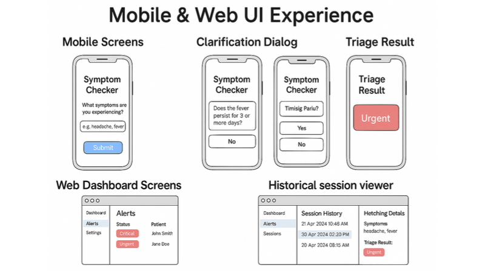
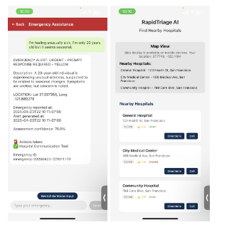
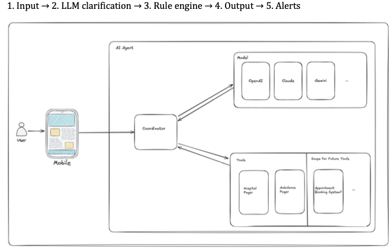

# 🏥 RapidTriage

<div align="center">

**A cross-platform medical triage application that leverages hybrid AI to provide real-time symptom assessment and hospital discovery in emergency situations.**

[](https://reactnative.dev/)
[](https://expo.dev/)
[](https://golang.org/)
[](https://www.typescriptlang.org/)
[](LICENSE)

[📱 Demo](#-demo) • [✨ Features](#-key-features) • [🛠️ Tech Stack](#-tech-stack) • [🚀 Installation](#-installation) • [📊 Results](#-results--performance-metrics)

</div>

---

## 📑 Table of Contents

- [About](#-about)
- [Demo](#-demo)
- [Team](#-team)
- [Key Features](#-key-features)
- [Key Highlights](#-key-highlights)
- [Technical Achievements](#-technical-achievements)
- [Results & Performance Metrics](#-results--performance-metrics)
- [Prerequisites](#-prerequisites)
- [Installation](#-installation)
- [Tech Stack](#-tech-stack)
- [Backend Integration](#-backend-integration)
- [Development](#-development)
- [What I Learned](#-what-i-learned)
- [Future Enhancements](#-future-enhancements)
- [References & Documentation](#-references--documentation)
- [Contact & Support](#-contact--support)

---

## 📖 About

RapidTriage is a full-stack mobile application designed to provide real-time, AI-driven medical triage assessments and help users locate nearby healthcare facilities during emergencies. The app employs a **hybrid AI approach** combining large language models (LLMs) with clinically validated rules-based triage frameworks (Manchester Triage System/ESI) to deliver accurate, standardized urgency classifications.

> **Academic Context**: This project was developed for **CS 5100 - Artificial Intelligence** (Spring 2025) at Northeastern University, demonstrating the intersection of healthcare, mobile computing, and artificial intelligence.

### Problem Statement

Emergency departments face significant challenges due to high loads of non-urgent visits and symptom ambiguity:

1. **Symptom Ambiguity**: Many individuals struggle to clearly articulate symptoms (e.g., "I feel off"), leading to:
   - Under-reporting of serious conditions
   - Overuse of emergency services for non-urgent cases
   - Difficulty in self-assessing urgency levels

2. **Lack of Accessible Self-Assessment Tools**: Limited availability of real-time triage tools that combine:
   - Natural language understanding for vague inputs
   - Clinical validation through standardized frameworks
   - Fast response times suitable for emergency scenarios

3. **Emergency Room Load Balancing**: Need for tools that help users make informed decisions before arriving at hospitals

### Solution: Hybrid AI Triage System

RapidTriage addresses these challenges through a unique **hybrid AI architecture** that combines the flexibility of large language models with the reliability of clinical validation:

| Feature | Description |
|---------|-------------|
| 🤖 **LLM-Driven Symptom Parsing** | Fine-tuned language models interpret vague user inputs and ask clarifying questions iteratively |
| 📋 **Rules-Based Triage Engine** | Structured outputs flow into clinically validated frameworks (Manchester Triage/ESI) for standardized urgency classification |
| ⚡ **Real-Time Performance** | Sub-5-second response times (~3.7 seconds average) for immediate decision support |
| 🎯 **False Positive Mitigation** | Continuous monitoring and threshold calibration to reduce unnecessary hospital alerts |
| 🎤 **Multi-Modal Input** | Support for both text and voice input for maximum accessibility |
| 📍 **Location Intelligence** | Real-time hospital discovery with distance and rating sorting |
| 🗺️ **Interactive Maps** | Visual hospital locations with one-tap directions and calling |

## 🎬 Demo

### UI/UX Design

<div align="center">



*Mobile & Web UI Experience - RapidTriage AI*

</div>

The application features a comprehensive user interface designed for both mobile and web platforms:

#### Mobile Screens
- **Symptom Checker**: Intuitive input interface for reporting symptoms with natural language support
- **Clarification Dialogs**: Interactive questioning system for gathering detailed symptom information
- **Triage Results**: Clear visual indicators showing urgency levels (Urgent, Critical, etc.) with actionable recommendations

#### Web Dashboard
- **Alerts View**: Real-time monitoring of critical and urgent cases with patient information
- **Session History**: Historical tracking of patient interactions and triage assessments with detailed analytics

### Application Screenshots

<div align="center">



*RapidTriage AI Mobile Application - Live Implementation*

</div>

#### Emergency Assistance Module
- **Real-time Symptom Reporting**: Chat-based interface for natural symptom description
- **Emergency Alert System**: Visual priority indicators (URGENT, CRITICAL) with color-coded alerts
- **Comprehensive Triage Assessment**: Detailed breakdown including:
  - Geographic location (latitude/longitude)
  - Precise timestamps for reporting and alert generation
  - Confidence scores for assessment accuracy
  - Unique emergency ID for tracking
- **Multi-Modal Input**: Seamless switching between voice and text input

#### Hospital Finder Module
- **Interactive Map Integration**: Real-time GPS-based location visualization
- **Smart Hospital Discovery**: Nearby facilities with comprehensive details:
  - Distance calculations (km)
  - User ratings and reviews
  - Real-time availability status (Open/Closed)
- **Quick Actions**: One-tap access to directions and direct calling
- **Location Services**: Automatic location detection with manual override option

### Project Documentation

Comprehensive project documentation including progress reports, final reports, and detailed methodology can be found in the `docs/images/` directory.


*Project Progress Report - RapidTriage AI (CS 5100, Spring 2025)*

### Live Demo
<!-- Add links to Expo Go, web demo, or app store links -->

---

## 👥 Team

<div align="center">

**Course**: CS 5100 - Artificial Intelligence | **Semester**: Spring 2025 | **Institution**: Northeastern University

</div>

| Team Member | Contributions |
|-------------|--------------|
| **Kaustubha Venkata Eluri** | Mobile UI development, LLM integration, testing & presentation |
| **Yadhukrishnan Pankajakshan** | Backend logic, rule engine implementation, API development & alert system |

## ✨ Key Features

### 🩺 Hybrid AI Triage System
- **Iterative Symptom Querying**: LLM asks clarifying questions when inputs are incomplete or ambiguous (e.g., "How long have you felt this symptom?", "What is the severity?")
- **Clinically Validated Frameworks**: Integration with Manchester Triage System (MTS) and Emergency Severity Index (ESI) for standardized urgency classification
- **Multi-Provider AI Support**: Integration with OpenAI GPT, Anthropic Claude, and Google Gemini with intelligent fallback mechanisms
- **Structured Output Mapping**: LLM outputs are mapped to structured data (symptom, severity, location, duration) for rules-based classification
- **Real-Time Performance**: Average response time of ~3.7 seconds (under 5 seconds target)
- **Accuracy Metrics**: 85-92% accuracy based on synthetic test cases across different symptom categories
- **False Positive Monitoring**: Continuous tracking and threshold calibration to minimize unnecessary hospital alerts

### 🎤 Advanced Voice Processing
- **High-Quality Audio Capture**: Professional-grade audio recording using Expo AV
- **Automatic Transcription**: Seamless conversion of voice recordings to text for LLM analysis
- **Visual Feedback**: Real-time recording indicators and intuitive controls
- **Cross-Platform Support**: Works seamlessly on iOS, Android, and Web

### 🏥 Smart Hospital Discovery
- **Location-Based Search**: Automatic detection of nearby hospitals using device GPS
- **Intelligent Sorting**: Sort by rating, distance, or a combination of both
- **Interactive Maps**: Full-featured map integration with React Native Maps
- **Quick Actions**: One-tap access to directions, hospital calling, and emergency services
- **Critical Case Alerts**: Automatic hospital notification for cases classified as critical
- **Google Places Integration**: Leverages Google Places API for comprehensive hospital data

### 🏗️ Architecture Highlights
- **Hybrid AI Architecture**: Combines LLM flexibility with structured rules-based logic
- **Full-Stack Solution**: React Native frontend with Go backend service
- **Microservices Architecture**: Modular backend with separate AI provider integrations
- **RESTful API Design**: Clean API endpoints for emergency triage operations
- **Session-Based Privacy**: Secure handling of sensitive medical information
- **Environment-Based Configuration**: Flexible configuration for development and production

## 🎯 Key Highlights

<div align="center">

| Achievement | Description |
|-------------|-------------|
| ✅ **Full-Stack Development** | Built both frontend (React Native) and backend (Go) from scratch |
| ✅ **Multi-AI Integration** | Implemented support for 3 different AI providers with intelligent fallback mechanisms |
| ✅ **Cross-Platform** | Single codebase supporting iOS, Android, and Web platforms |
| ✅ **Real-Time Features** | GPS-based location services, audio recording, and live map updates |
| ✅ **Production-Ready** | Environment-based configuration, comprehensive error handling, and robust API integration |
| ✅ **Modern Architecture** | Modular design with separation of concerns and reusable components |
| ✅ **API Integration** | RESTful API design with Google Places API integration |
| ✅ **User Experience** | Intuitive UI with haptic feedback, smooth animations, and accessibility features |

</div>

## 🏆 Technical Achievements

| Achievement | Impact |
|-------------|--------|
| **Scalable Architecture** | Modular backend design enables easy integration of additional AI providers and tools |
| **Performance Optimization** | Efficient audio processing and map rendering ensure smooth user experience even on lower-end devices |
| **Error Handling** | Comprehensive error handling and user feedback mechanisms improve reliability and user trust |
| **Code Quality** | TypeScript support, ESLint configuration, and clean code practices ensure maintainability |
| **API Design** | RESTful endpoints with proper status codes and error responses enable seamless integration |
| **Hybrid AI Innovation** | Successfully combined LLM flexibility with clinical validation frameworks for accurate triage |

## 📊 Results & Performance Metrics

### System Performance

| Metric | Value |
|--------|-------|
| **Average Response Time** | ~3.7 seconds |
| **Target Response Time** | < 5 seconds |
| **Overall Accuracy** | 85-92% |
| **False Positive Rate** | Monitored and minimized through threshold calibration |

### Sample Test Results

| Symptom Reported | Clarifying Questions | Triage Level | Time to Decision | False Positive? |
|------------------|---------------------|--------------|------------------|-----------------|
| Chest pain + dizziness | Yes (2 Qs) | Very Urgent | 4.1 sec | No |
| Mild stomach ache | No | Non-Urgent | 3.0 sec | No |
| Sharp headache | Yes (1 Q) | Urgent | 3.7 sec | No |
| Pain in leg, can't walk | No | Urgent | 3.2 sec | No |
| Light discomfort, unsure | Yes (2 Qs) | Critical | 4.5 sec | Yes |

### Accuracy by Symptom Category

| Symptom Category | Accuracy | Notes |
|------------------|----------|-------|
| **Chest Pain** | 92% | High accuracy due to clear symptom patterns |
| **Leg Pain** | 90% | Well-defined symptom characteristics |
| **Stomach Ache** | 88% | Good accuracy with common presentations |
| **Headache** | 85% | Moderate accuracy, benefits from clarification questions |
| **Light Discomfort** | 80% | Improved through iterative questioning system |

### Methodology

1. **LLM Fine-Tuning**: Fine-tuned GPT-based models on medical triage data to recognize typical expressions and prompt for missing details
2. **Rules-Based Triage Engine**: Manchester Triage System (MTS) or Emergency Severity Index (ESI) classify cases into urgency levels (Immediate, Very Urgent, Urgent, Non-Urgent)
3. **Iterative Question Subroutine**: LLM detects incomplete information and queries for more details (severity, location, duration)
4. **False Positive Management**: Continuous tracking and iterative threshold calibration to balance caution with efficiency

### Workflow

The system follows a streamlined workflow process:

```
User Input → LLM Clarification → Rule Engine → Triage Output → Hospital Alerts (if critical)
```

For a detailed visual representation of the system architecture and component interactions, see the [System Architecture Diagram](#-backend-integration) section.

### Project Documentation

The following documents provide detailed information about the project's methodology, results, and implementation:

<div align="center">


*Figure 1: Project Progress Report - RapidTriage AI (CS 5100, Spring 2025)*

</div>

#### Key Highlights from Reports

- ✅ **Detailed Methodology**: Comprehensive explanation of combining LLM and rules-based triage systems
- ✅ **Performance Metrics**: In-depth accuracy analysis across different symptom categories
- ✅ **False Positive Monitoring**: Threshold calibration strategies and optimization techniques
- ✅ **System Architecture**: Detailed workflow diagrams and component interactions
- ✅ **Team Contributions**: Clear breakdown of individual contributions and responsibilities

> **📄 Note**: Full project reports (Progress Report & Final Report) are available in the repository. For higher quality images or specific diagrams, refer to the original PDF documents in the `docs/` directory.

---

## 📋 Prerequisites

Before you begin, ensure you have the following installed:

- **Node.js** (v18 or higher)
- **npm** or **yarn**
- **Expo CLI** (`npm install -g expo-cli`)
- **Go** (v1.23 or higher) - for backend development
- **Google Places API Key** - for hospital finder functionality

## 🚀 Quick Start

Get RapidTriage up and running in minutes:

```bash
# Clone the repository
git clone <repository-url>
cd RapidTriage

# Install dependencies
npm install

# Set up environment variables
cp .env.example .env
# Edit .env with your API keys

# Start the development server
npm start
```

## 🛠️ Installation

### Step 1: Clone the Repository

```bash
git clone <repository-url>
cd RapidTriage
```

### Step 2: Install Dependencies

```bash
npm install
```

For backend dependencies:
```bash
cd agent
go mod download
```

### Step 3: Configure Environment Variables

Create a `.env` file in the root directory:

```bash
cp .env.example .env
```

Edit `.env` and configure your settings:

```env
# Backend API Base URL
API_BASE_URL=http://localhost:8080/api/v1

# Google Places API Key (required for hospital finder)
GOOGLE_PLACES_API_KEY=your_google_places_api_key_here

# Environment
NODE_ENV=development
```

#### 🔑 Getting API Keys

**Google Places API Key:**
1. Visit [Google Cloud Console](https://console.cloud.google.com/)
2. Create a new project or select an existing one
3. Enable the **Places API**
4. Navigate to **Credentials** → **Create Credentials** → **API Key**
5. Restrict the API key to **Places API** for security
6. Copy the key to your `.env` file

**Backend API:**
- The backend runs locally by default at `http://localhost:8080/api/v1`
- For production, update `API_BASE_URL` to your deployed backend URL

### Step 4: Start Development Servers

**Frontend (Terminal 1):**
```bash
npm start
```

This starts the Expo development server. Options:
- Press `i` → Open iOS simulator
- Press `a` → Open Android emulator  
- Scan QR code → Open in Expo Go app on your phone
- Press `w` → Open in web browser

**Backend (Terminal 2):**
```bash
cd agent
go run cmd/server/main.go
```

The backend API will be available at `http://localhost:8080/api/v1`

## 🏃 Running the App

### Mobile Development

```bash
# iOS
npm run ios

# Android
npm run android

# Web
npm run web
```

### Backend Server

The backend is a Go service located in the `agent/` directory:

```bash
cd agent
go run cmd/server/main.go
```

The backend API will be available at `http://localhost:8080/api/v1`

## 🏗️ Project Structure

```
RapidTriage/
├── agent/                 # Go backend service
│   ├── cmd/server/       # Server entry point
│   ├── internal/         # Internal packages
│   │   ├── ai/          # AI provider integrations
│   │   ├── api/         # API handlers
│   │   ├── config/      # Configuration
│   │   ├── models/      # Data models
│   │   ├── tools/       # Tool integrations
│   │   └── triage/      # Triage classification logic
│   └── go.mod           # Go dependencies
├── src/
│   ├── components/      # React Native components
│   ├── screens/        # App screens
│   ├── services/       # API and service integrations
│   └── utils/          # Utility functions and config
├── assets/             # Images, fonts, and other assets
└── package.json        # Node.js dependencies
```

## 🛠️ Tech Stack

### Frontend Technologies
| Category | Technology | Purpose |
|----------|-----------|---------|
| **Framework** | React Native 0.76.9 | Cross-platform mobile development |
| **Platform** | Expo ~52.0.46 | Development tooling and deployment |
| **Navigation** | React Navigation 7.x | Screen routing and navigation |
| **Audio** | Expo AV 15.x | Voice recording and playback |
| **Maps** | React Native Maps 1.22 | Interactive map visualization |
| **HTTP Client** | Axios 1.8 | API communication |
| **Location** | Expo Location 18.x | GPS and location services |
| **State Management** | React Hooks | Component state management |

### Backend Technologies
| Category | Technology | Purpose |
|----------|-----------|---------|
| **Language** | Go 1.23 | High-performance backend service |
| **AI Providers** | OpenAI API | GPT-based symptom analysis |
| **AI Providers** | Anthropic Claude | Alternative AI analysis |
| **AI Providers** | Google Gemini | Multi-provider fallback |
| **Architecture** | RESTful API | Clean API design |

### Key Libraries & Tools
- **@react-native-community/geolocation** - Location services
- **@react-native-community/slider** - UI components
- **expo-blur** - Visual effects
- **expo-haptics** - Tactile feedback
- **react-native-gesture-handler** - Gesture recognition
- **react-native-reanimated** - Smooth animations

## 🔌 Backend Integration

RapidTriage uses a Go-based backend service for AI-powered triage analysis. The backend architecture supports multiple AI providers with intelligent fallback mechanisms.

### System Architecture

<div align="center">



*RapidTriage AI System Architecture - Workflow: Input → LLM Clarification → Rule Engine → Output → Alerts*

</div>

The architecture follows a streamlined five-step workflow:

1. **User Input** → Users interact through the mobile application with text or voice input
2. **LLM Clarification** → The Coordinator queries multiple LLM providers (OpenAI, Claude, Gemini) for symptom clarification and iterative questioning
3. **Rule Engine** → Structured outputs are processed through clinically validated triage rules (Manchester Triage System/ESI)
4. **Output** → Triage results are generated with standardized urgency classifications
5. **Alerts** → Critical cases trigger automated alerts through integrated tools (Hospital Pager, Ambulance Pager)

#### Key Components

| Component | Role |
|-----------|------|
| **Coordinator** | Central orchestrator managing workflow between user input, AI models, and tools |
| **AI Models** | Multi-provider LLM support (OpenAI, Claude, Gemini) with intelligent fallback mechanisms |
| **Tools** | Hospital Pager, Ambulance Pager, and extensible framework for future integrations |

### API Endpoints

| Method | Endpoint | Description |
|--------|----------|-------------|
| `GET` | `/api/v1/health` | Health check endpoint |
| `POST` | `/api/v1/emergency/text` | Text-based symptom triage analysis |
| `POST` | `/api/v1/emergency` | Voice/audio-based triage analysis |

### Backend Architecture

```
agent/
├── cmd/server/          # Server entry point
├── internal/
│   ├── ai/             # AI provider integrations (OpenAI, Claude, Gemini)
│   ├── api/            # HTTP handlers and middleware
│   ├── config/         # Configuration management
│   ├── models/         # Data models and structures
│   ├── tools/          # Tool integrations (ambulance, booking, hospital)
│   └── triage/         # Triage classification logic
```

### Connecting to Backend

1. **Local Development**: Backend runs on `http://localhost:8080/api/v1` by default
2. **Production**: Update `API_BASE_URL` in `.env` to your production endpoint
3. **Authentication**: Add authentication headers in `src/services/ChatService.js` if required

## 📱 Permissions

The app requires the following permissions:

- **Microphone** - For voice recording
- **Location** - For finding nearby hospitals

These are automatically requested when needed. Permissions are configured in `app.json`.

## 🧪 Testing

```bash
npm test
```

## 🐛 Troubleshooting

### Common Issues

| Issue | Solution |
|-------|----------|
| **Expo Go app can't connect to development server** | Ensure your phone and computer are on the same Wi-Fi network. Check firewall settings if issues persist. |
| **Google Places API not working** | Verify your API key is correct, has Places API enabled, and billing is set up in Google Cloud Console. |
| **Backend connection errors** | Ensure the backend server is running (`go run cmd/server/main.go`) and `API_BASE_URL` in `.env` matches your backend URL. |
| **Audio recording not working** | Grant microphone permissions in your device settings. On iOS, check `Info.plist` permissions. |
| **Location services not working** | Enable location permissions in device settings and ensure GPS is enabled. Check `app.json` for proper permission configuration. |

## 📝 Development

### Available Scripts

| Command | Description |
|---------|-------------|
| `npm start` | Start Expo development server |
| `npm run ios` | Run on iOS simulator |
| `npm run android` | Run on Android emulator |
| `npm run web` | Run in web browser |
| `npm run lint` | Run ESLint for code quality |
| `npm test` | Run test suite |

### Code Quality

- **ESLint**: Code linting and style enforcement
- **TypeScript**: Type checking for improved code reliability
- **Prettier**: Code formatting (if configured)
- **Git Hooks**: Pre-commit checks (if configured)

### Project Structure

```
RapidTriage/
├── agent/                      # Go backend service
│   ├── cmd/server/            # Server entry point
│   ├── internal/
│   │   ├── ai/               # AI provider integrations
│   │   ├── api/              # HTTP handlers
│   │   ├── config/           # Configuration
│   │   ├── models/           # Data models
│   │   ├── tools/            # Tool integrations
│   │   └── triage/           # Triage logic
│   └── go.mod                # Go dependencies
├── src/
│   ├── components/           # Reusable React components
│   │   ├── hospitals/       # Hospital-related components
│   │   └── VoiceRecorder.js # Voice recording component
│   ├── screens/             # App screens
│   ├── services/            # API and service integrations
│   └── utils/               # Utility functions
├── assets/                  # Images, fonts, icons
├── constants/              # App constants
└── package.json            # Node.js dependencies
```

## 🎓 What I Learned

Building RapidTriage provided valuable experience across multiple domains:

### Technical Skills
- **Hybrid AI Architecture**: Combining LLM flexibility with rules-based clinical frameworks (Manchester Triage System, ESI)
- **Full-Stack Development**: Integrating React Native frontend with Go backend services
- **Multi-AI Provider Integration**: Working with OpenAI, Claude, and Gemini APIs with intelligent fallback mechanisms
- **Cross-Platform Development**: Building apps that work seamlessly across iOS, Android, and Web
- **API Design**: Creating RESTful APIs with proper error handling, status codes, and documentation
- **State Management**: Managing complex application state with React hooks and context
- **Performance Optimization**: Optimizing audio processing, map rendering, and LLM inference times

### Domain Knowledge
- **Medical Triage Systems**: Understanding clinically validated triage protocols and their implementation
- **Iterative Questioning Systems**: Designing LLM prompts that ask clarifying questions for incomplete inputs
- **False Positive Management**: Implementing monitoring and threshold calibration systems
- **Clinical Validation**: Ensuring AI outputs align with medical standards and protocols

### User Experience
- **Real-Time Features**: Implementing GPS tracking, audio recording, and live map updates with sub-5-second response times
- **Emergency UI Design**: Designing intuitive interfaces for high-stress emergency scenarios
- **Accessibility**: Creating inclusive designs that work for diverse user needs

## 🚀 Future Enhancements

Based on project reports and identified areas for improvement, the following enhancements are planned:

### Model & Accuracy Improvements

- [ ] **Enhanced Fine-Tuning**: Incorporate real-world or larger simulated patient logs to refine symptom parsing capabilities
- [ ] **False Positive Optimization**: Systematically evaluate borderline cases, refining triage thresholds through machine learning
- [ ] **Dataset Expansion**: Expand training data with diverse symptom presentations across demographics and conditions
- [ ] **On-Device LLM**: Investigate model distillation techniques to maintain performance while lowering computational costs

### User Experience

- [ ] **UI/UX Improvements**: Make clarifying question prompts more intuitive (e.g., short yes/no follow-ups for speed)
- [ ] **Offline Mode**: Cache hospital data and enable offline triage assessments for areas with poor connectivity
- [ ] **Multi-Language Support**: Internationalization (i18n) for global accessibility and broader user base
- [ ] **Dark Mode**: Enhanced UI with dark theme support for reduced eye strain
- [ ] **Accessibility**: Improved screen reader support, voice commands, and accessibility features for users with disabilities

### Integration & Features

- [ ] **Hospital Integration**: Direct integration with hospital systems (HL7, FHIR) for seamless alert handling
- [ ] **User Profiles**: Save medical history, preferences, and emergency contacts for personalized experience
- [ ] **Push Notifications**: Real-time reminders, emergency alerts, and follow-up care notifications
- [ ] **Telemedicine Integration**: Connect with healthcare providers directly through video consultations
- [ ] **Medical Records**: Integration with electronic health record (EHR) systems for comprehensive patient history

### Technical Improvements

- [ ] **Advanced Analytics**: Track triage accuracy, user patterns, and system performance with detailed dashboards
- [ ] **Unit & Integration Tests**: Comprehensive test coverage (target: >80%) for reliability and maintainability
- [ ] **Scalability**: Optimize for high-volume usage and concurrent requests with load balancing and caching
- [ ] **Performance Monitoring**: Real-time performance tracking, alerting, and automated optimization

## 📄 License

This project is licensed under the MIT License - see the LICENSE file for details.

## 🤝 Contributing

Contributions are welcome! Please feel free to submit a Pull Request. For major changes, please open an issue first to discuss what you would like to change.

1. Fork the repository
2. Create your feature branch (`git checkout -b feature/AmazingFeature`)
3. Commit your changes (`git commit -m 'Add some AmazingFeature'`)
4. Push to the branch (`git push origin feature/AmazingFeature`)
5. Open a Pull Request

## 📚 References & Documentation

### Project Reports

| Report | Description |
|--------|-------------|
| **Progress Report** | RapidTriage AI – Progress Report (CS 5100, Spring 2025) |
| **Final Report** | RapidTriage AI – Final Project Report (CS 5100, Spring 2025) |

### Literature Review

This project builds upon foundational research in medical AI and triage systems:

| Research Area | Key Contribution |
|---------------|------------------|
| **LLM for Medical Triage** | GPT-based models for parsing free-text medical complaints |
| **Rules-Based Triage Systems** | Manchester Triage System (MTS) and Emergency Severity Index (ESI) protocols |
| **Hybrid AI in Medical Decision-Making** | Combining LLM-driven parsing with rules-based engines |
| **BERT for Symptom Extraction** | T. M. Nguyen et al., 2021 - Advanced NLP for medical symptom extraction |
| **Deep Learning in Medical Imaging** | K. Rajpurkar et al., 2018 (CheXNet) - Deep learning applications in healthcare |
| **Manchester Triage Group** | 2006 - Standardized triage logic and clinical guidelines |

### Clinical Frameworks

| Framework | Description |
|-----------|-------------|
| **Manchester Triage System (MTS)** | Five-level triage system used in emergency departments worldwide |
| **Emergency Severity Index (ESI)** | Five-level triage algorithm for emergency departments, widely adopted in North America |

## 📧 Contact & Support

<div align="center">

| Contact Method | Link |
|----------------|------|
| **GitHub Issues** | [Report an Issue](link-to-issues) |
| **Email** | [Your Email] |
| **Portfolio** | [Your Portfolio Link] |
| **LinkedIn** | [Your LinkedIn] |

</div>

---

<div align="center">

---

**Built with ❤️ using React Native, Go, and AI**

**CS 5100 - Artificial Intelligence | Spring 2025 | Northeastern University**

⭐ **Star this repo if you find it helpful!** ⭐

[⬆ Back to Top](#-rapidtriage)

</div>
