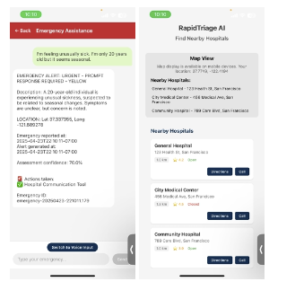
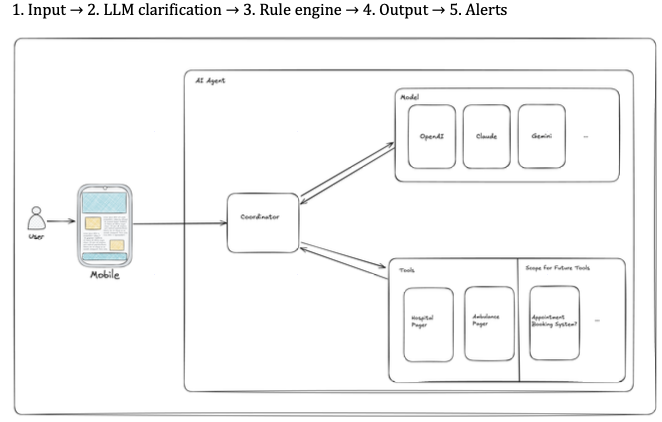
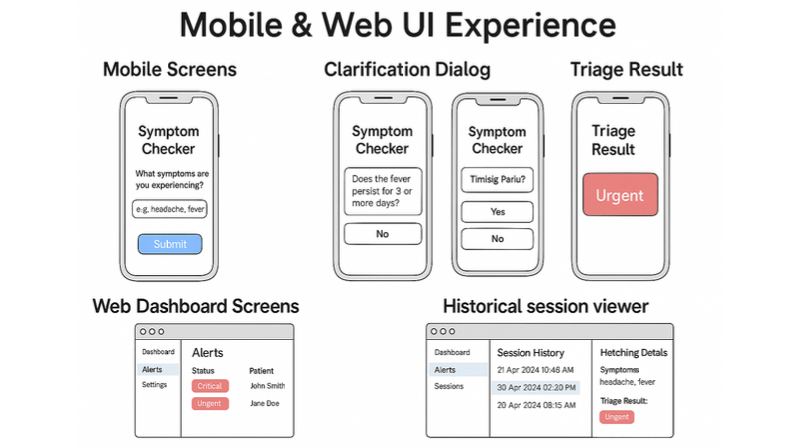

# RapidTriage

> A cross-platform medical triage application that combines large language models with clinically validated rules-based frameworks (Manchester Triage System / ESI) to deliver real-time symptom assessment and hospital discovery. React Native + Expo on the frontend, Go on the backend, multi-provider AI on the inside.

[](https://reactnative.dev)
[](https://expo.dev)
[](https://golang.org)
[](https://www.typescriptlang.org)
[](LICENSE)

Emergency departments face significant load from non-urgent visits and symptom ambiguity. Patients often struggle to articulate symptoms ("I feel off"), self-assessment tools are limited, and the gap leads to under-reporting of serious conditions and overuse of emergency services. RapidTriage bridges that gap with a hybrid AI architecture — LLMs handle natural language and iterative clarification, structured rules engines deliver clinically standardized urgency classifications. **Academic context:** built for CS 5100 — Artificial Intelligence (Spring 2025) at Northeastern University.

---

## Screenshots

| Mobile Screens | Architecture | UI/UX Mockup |
|:-:|:-:|:-:|
|  |  |  |

---

## Features

### Hybrid AI Triage
- **LLM-driven symptom parsing** — fine-tuned language models interpret vague user inputs and ask clarifying questions iteratively
- **Rules-based triage engine** — structured outputs flow into clinically validated frameworks (Manchester Triage / ESI) for standardized urgency classification (Immediate, Very Urgent, Urgent, Non-Urgent)
- **Multi-provider AI** — OpenAI GPT, Anthropic Claude, and Google Gemini with intelligent fallback between providers
- **Real-time performance** — average response time ~3.7 s, under 5 s target
- **False positive mitigation** — continuous monitoring + threshold calibration to reduce unnecessary hospital alerts
- **Iterative questioning** — when inputs are incomplete, the LLM asks short follow-ups (severity, location, duration)

### Multi-Modal Input
- **Voice + text** — switch freely; voice recordings are transcribed automatically
- **High-quality audio capture** — Expo AV recording with visual feedback indicators
- **Cross-platform** — iOS, Android, and web from a single codebase

### Hospital Discovery
- **Real-time GPS** — automatic location detection with manual override
- **Smart sorting** — by distance, rating, or a combination
- **Interactive maps** — React Native Maps with one-tap directions and direct calling
- **Google Places integration** — comprehensive hospital metadata (distance, ratings, open/closed status)
- **Critical case alerts** — automatic hospital notification when triage classifies a case as critical

### Emergency Escalation
- **Visual priority indicators** — color-coded URGENT, CRITICAL, IMMEDIATE alerts
- **Comprehensive assessment record** — geographic location, timestamps, confidence score, unique emergency ID for tracking

---

## Architecture

```
User Input  →  LLM Clarification  →  Rule Engine  →  Triage Output  →  Hospital Alerts (if critical)
```

Five-step workflow:

1. **User input** — text or voice through the mobile app.
2. **LLM clarification** — the Coordinator queries OpenAI / Claude / Gemini for symptom parsing and follow-up questions.
3. **Rule engine** — structured outputs are classified by MTS / ESI logic.
4. **Output** — triage result with urgency level + confidence score.
5. **Alerts** — critical cases trigger automated notifications via integrated tools (Hospital Pager, Ambulance Pager).

### Components

| Component | Role |
|---|---|
| **Coordinator** | Central orchestrator wiring user input, AI models, and tools |
| **AI Models** | Multi-provider LLM support (OpenAI, Claude, Gemini) with fallback |
| **Tools** | Hospital Pager, Ambulance Pager, extensible for future integrations |

### Project structure

```
RapidTriage/
├── agent/                 Go backend service
│   ├── cmd/server/        Server entry point
│   ├── internal/
│   │   ├── ai/            AI provider integrations
│   │   ├── api/           HTTP handlers
│   │   ├── config/        Configuration
│   │   ├── models/        Data models
│   │   ├── tools/         Pager / alert integrations
│   │   └── triage/        MTS / ESI classification logic
│   └── go.mod
├── src/                   React Native frontend
│   ├── components/
│   ├── screens/
│   ├── services/          API + service integrations
│   └── utils/
├── assets/
├── docs/                  Reports + thumbnails
├── Screenshots/           README captures
└── package.json
```

### API endpoints

| Method | Endpoint | Description |
|---|---|---|
| `GET` | `/api/v1/health` | Health check |
| `POST` | `/api/v1/emergency/text` | Text-based symptom triage |
| `POST` | `/api/v1/emergency` | Voice / audio-based triage |

---

## Design System

| Token | Value |
|---|---|
| Brand | RapidTriage red — used for urgent/critical states |
| Accent | Blue — informational chrome, links, primary CTAs |
| Surface | iOS / Android system surface (light + dark) |
| Typography | System default (SF on iOS, Roboto on Android), 5 levels: title / headline / body / callout / caption |
| Spacing | 4-point grid (4 / 8 / 12 / 16 / 20 / 24 / 32) |

Color-coded urgency badges: `Immediate / Very Urgent / Urgent / Non-Urgent`. Haptic feedback via `expo-haptics` on every decision-point tap; blur effects via `expo-blur` for emergency modal sheets.

---

## Tech Stack

### Frontend

| Layer | Choice |
|---|---|
| Framework | React Native 0.76.9 |
| Platform | Expo ~52.0.46 |
| Navigation | React Navigation 7.x |
| Audio | Expo AV 15.x |
| Maps | React Native Maps 1.22 |
| HTTP | Axios 1.8 |
| Location | Expo Location 18.x |
| State | React hooks |
| Animation | react-native-reanimated, react-native-gesture-handler |
| Tactile | expo-haptics, expo-blur |

### Backend

| Layer | Choice |
|---|---|
| Language | Go 1.23 |
| AI providers | OpenAI GPT, Anthropic Claude, Google Gemini |
| Architecture | RESTful API, modular `internal/` packages |
| Tools | Hospital Pager, Ambulance Pager |

---

## Getting Started

### Prerequisites
- Node.js v18+
- npm or yarn
- Expo CLI (`npm install -g expo-cli`)
- Go v1.23+ for backend
- Google Places API key for hospital finder

### Setup

```bash
git clone <repository-url>
cd RapidTriage

# Frontend
npm install

# Backend
cd agent && go mod download && cd ..

# Environment
cp .env.example .env
```

Edit `.env`:

```env
API_BASE_URL=http://localhost:8080/api/v1
GOOGLE_PLACES_API_KEY=your_google_places_api_key
NODE_ENV=development
```

**Google Places key:** Cloud Console → enable **Places API** → Credentials → Create API Key → restrict to Places API → paste into `.env`.

### Run

**Terminal 1 — Frontend:**
```bash
npm start
# press i (iOS), a (Android), w (web), or scan QR for Expo Go
```

**Terminal 2 — Backend:**
```bash
cd agent
go run cmd/server/main.go
```

Platform shortcuts:

```bash
npm run ios       # iOS simulator
npm run android   # Android emulator
npm run web       # browser
npm test          # test suite
npm run lint      # ESLint
```

---

## Results & Performance

| Metric | Value |
|---|---|
| Average response time | ~3.7 s |
| Target | < 5 s |
| Overall accuracy | 85–92% |
| False positive rate | Monitored, threshold-calibrated |

### Sample test cases

| Symptom | Clarifying questions | Triage level | Time | False positive? |
|---|---|---|---|---|
| Chest pain + dizziness | 2 | Very Urgent | 4.1 s | No |
| Mild stomach ache | 0 | Non-Urgent | 3.0 s | No |
| Sharp headache | 1 | Urgent | 3.7 s | No |
| Pain in leg, can't walk | 0 | Urgent | 3.2 s | No |
| Light discomfort, unsure | 2 | Critical | 4.5 s | Yes |

### Accuracy by category

| Category | Accuracy | Notes |
|---|---|---|
| Chest pain | 92% | Clear symptom patterns |
| Leg pain | 90% | Well-defined characteristics |
| Stomach ache | 88% | Common presentations decode reliably |
| Headache | 85% | Benefits from clarification questions |
| Light discomfort | 80% | Improved via iterative questioning |

---

## Permissions

- **Microphone** — voice recording
- **Location** — nearby hospitals

Configured in `app.json`; requested at runtime when needed.

---

## Roadmap

### Model & accuracy
- Enhanced fine-tuning on real-world / larger synthetic patient logs
- False-positive optimization on borderline cases
- Dataset expansion across demographics and conditions
- On-device LLM via distillation for cost + latency

### User experience
- Yes/no clarification follow-ups for speed
- Offline mode with cached hospital data
- i18n / multi-language support
- Dark mode
- Improved screen reader + voice command accessibility

### Integration
- HL7 / FHIR hospital system integration
- User profiles with medical history + emergency contacts
- Push notifications for alerts and follow-ups
- Telemedicine video consultations
- EHR integration

### Technical
- Triage accuracy + system performance dashboards
- >80% test coverage target
- Load balancing + caching for high-volume usage
- Real-time performance monitoring

---

## Troubleshooting

| Issue | Fix |
|---|---|
| Expo Go can't connect | Phone + computer on same Wi-Fi; check firewall |
| Google Places not working | Verify key + Places API enabled + billing set |
| Backend connection errors | Confirm backend running on `:8080`; check `API_BASE_URL` |
| Audio recording fails | Grant microphone permission in device settings |
| Location not working | Enable location permission + GPS in device settings |

---

## Tradeoffs

- **Hybrid AI, not pure LLM.** A pure-LLM triage system can hallucinate escalation errors and has no auditable rationale; a pure rule-based system is too rigid for natural-language complaints. We split: LLM parses, rule engine classifies. Each layer plays to its strength. See [docs/decisions.md, ADR-001](docs/decisions.md#adr-001--hybrid-ai-llm-clarification--rule-based-classification).
- **MTS/ESI-*inspired*, not -*certified*.** We adapted the decision-tree pattern as a pedagogical reference. The canonical rule sets are licensed and require formal training. We don't pretend otherwise. See [ADR-002](docs/decisions.md#adr-002--mtsesi-inspired-not-mtsesi-certified).
- **Mock-backed tools.** The agent's tool-invocation pattern is real — concurrent fan-out, retries, timeouts. The HTTP layer in `mockHTTPClient` returns hardcoded JSON. Production wiring is a one-file swap per tool. See [ADR-004](docs/decisions.md#adr-004--mock-backed-tools).
- **Safety-biased fallback.** If classifier confidence < 0.5, the code falls back to YELLOW (Urgent), not GREEN (Non-Urgent). Type-II error (missing an urgent case) is much worse than Type-I (escalating a non-urgent case). See [ADR-007](docs/decisions.md#adr-007--fallback-to-yellow-on-low-classifier-confidence).
- **Go over Python or Node for the backend.** Native goroutine concurrency for tool fan-out, graceful shutdown with deadline so in-flight emergencies aren't cut off on SIGTERM, single-binary deploy, strict timeouts at every layer.
- **Expo over native split.** One codebase for iOS / Android / web; the team is 2 people and the deadline was one semester. Native split would have tripled the surface for a wash on UX. See [ADR-005](docs/decisions.md#adr-005--mobile--expo--react-native-not-a-native-split).

Full ADRs in [docs/decisions.md](docs/decisions.md).

---

## Limitations

See [docs/limitations.md](docs/limitations.md). Top items:

- **Not clinically certified.** Academic project, not a medical device.
- **Tools are mocked**, not connected to real hospital / ambulance / booking systems.
- **Performance numbers are demo-grade**, not statistically rigorous evaluation.
- **No offline mode, no on-device LLM, no multilingual support yet** — all roadmap items.
- **No HIPAA compliance audit.** Symptom descriptions can be PHI in some jurisdictions.

---

## Quality Gates

- `go build ./...` passes clean against Go 1.23.
- `go vet ./...` produces no warnings.
- React Native lints clean via `expo lint`.
- All HTTP requests bounded by `ReadTimeout=30s`, `WriteTimeout=30s`, `IdleTimeout=120s`.
- All AI provider calls bounded by `API_TIMEOUT_SECONDS` (default 30s).
- Server lifecycle wired to SIGINT/SIGTERM with a 10-second graceful-shutdown deadline.
- Audio upload capped at `MAX_AUDIO_SIZE_MB` (default 20 MB).
- Tool fan-out bounded by `MaxConcurrentTools` (default 5).
- Classifier confidence threshold + safer fallback code (YELLOW) configurable in `ClassifierConfig`.

---

## Project Stats

- **5** React Native screens, **3** services (Audio, Chat, Location)
- **~15** Go packages under `agent/internal/` (ai, api, config, models, tools/*, triage)
- **4** AI providers (Gemini default, Claude, OpenAI, Llama)
- **4** tools (Location, Hospital, Ambulance, Booking) all on a shared `Do(req)` interface
- **3** REST endpoints (`/api/v1/health`, `/api/v1/emergency`, `/api/v1/emergency/text`)
- **4** triage codes (`IMMEDIATE`, `VERY URGENT`, `URGENT`, `NON-URGENT`)
- **~3.7s** average response time on classroom test set
- **CPU-only inference path** — no GPU dependency

## Team

| Member | Contributions |
|---|---|
| **Kaustubha Venkata Eluri** | Mobile UI development, LLM integration, testing, presentation |
| **Yadhukrishnan Pankajakshan** | Backend logic, rule engine, API development, alert system |

---

## References

| Area | Contribution |
|---|---|
| LLM for medical triage | GPT-based models for free-text complaint parsing |
| Rules-based triage | Manchester Triage System (MTS) + Emergency Severity Index (ESI) |
| Hybrid AI in medical decision-making | LLM-driven parsing combined with rules-based engines |
| BERT for symptom extraction | T. M. Nguyen et al., 2021 |
| Deep learning in medical imaging | K. Rajpurkar et al., 2018 (CheXNet) |
| Manchester Triage Group | 2006 — standardized triage logic |

Progress and final project reports live in `docs/` (thumbnails referenced in `docs/images/`).

---

## License

[MIT](LICENSE)

---

*Built with React Native, Go, and a hybrid AI architecture by Kaustubha Eluri and Yadhukrishnan Pankajakshan for CS 5100 at Northeastern University.*
